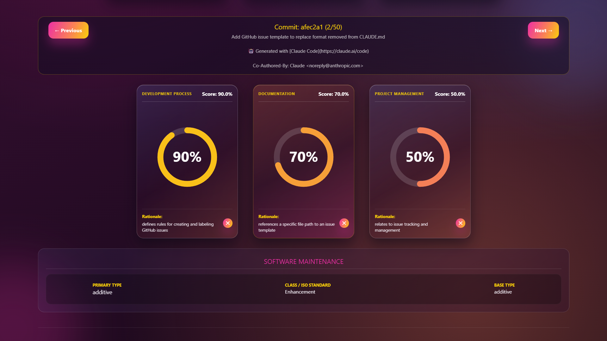

---

# ContextWare


ContextWare is a dedicated analytical pipeline designed to track, classify, and evaluate the historical evolution of Agent Context Files (ACFs) such as `CLAUDE.md` and `AGENTS.md`. By extracting GitHub commit diffs, the system leverages Prompt Engineering and a Multi-LLM architecture to classify both the semantic topic of the changes and the underlying software maintenance rationale.

This project aims to move beyond empirical observation by systematically quantifying the semantic ambiguity and stability of instructions provided to AI coding agents.

## Key Features

* **Automated Diff Extraction & Parsing:** Interfaces with the GitHub API to extract, clean, and chronologically aggregate unified diffs from commit histories, filtering out structural noise to isolate semantic additions and removals.


* **Two-Dimensional LLM Classification:** Uses advanced prompt engineering to evaluate diffs on two orthogonal axes:

    * **Topic Categories:** Multi-label classification across 16 semantic categories (System Overview, AI Integration, Documentation, Architecture, Impl. Details, Build and Run, Testing, Conf.&Env., DevOps, Development Process, Project Management, Maintenance, Debugging, Performance, Security, UI/UX).


    * **Maintenance Reason:** Single-label classification based on the ISO/IEC/IEEE 14764 standard (Corrective, Preventive, Adaptive (Correction), Adaptive (Enhancement), Additive, Perfective).


* **Multi-Model Cross-Validation:** Runs concurrent, asynchronous validation across diverse LLMs (e.g., `kimi-k2.7-code`, `qwen3.5`, `glm-5.2`, benchmarked against `gemma4`) to compute inter-rater agreement metrics like Fleiss' Kappa, Cohen's Kappa, and Jaccard similarity.


* **Semantic Ambiguity Quantification:** Measures instruction ambiguity by analyzing inter-model divergence and Shannon entropy across the LLM panel.


* **Golden Standard Benchmarking:** Evaluates model predictions against a human-annotated gold sample to report Precision, Recall, and F1 scores.


* **Interactive Web Dashboard:** Features a Quart-based web interface with Server-Sent Events (SSE) for real-time analysis streaming, complete with rich data visualizations.


## Architecture & Modules

The repository is structured into distinct modules handling specific phases of the analytical pipeline:

### 1. Core Analysis (`acf-analysis/`)

* `acf_analyser.py`: The core orchestrator for LLM interaction. Handles adaptive chunking of large diffs, rate-limiting, and error-recovery/graceful degradation (e.g., schema fallbacks).


* `acf_prompt.py`: Contains the system prompts, the 16-category taxonomy, and the maintenance-type logic that forces models to output structured JSON.


* `agreement_analysis.py`: Computes statistical inter-model agreement and ambiguity metrics across the multi-LLM outputs.


* `category_analysis.py`: Generates distribution shifts, co-occurrence matrices, and conditional probability heatmaps to highlight classification biases.


### 2. Golden Standard Evaluation (`golden_results/`)

* `check_gold_labels.py`: Validates the manually annotated labels against the canonical `categories.json` vocabulary to prevent typo-driven data loss.


* `evaluate_against_gold.py`: Compares the models' automated classifications against the human baseline to calculate accuracy, error rates, and semantic divergence.


### 3. Web Interface

* `server.py`: A Quart asynchronous server that streams analysis progress to the client and coordinates the multi-model benchmarking script.


* `index.html`: The frontend dashboard featuring dynamic SVGs, metric cards, and charts to interactively explore repository histories.


## Getting Started

The project is fully tested and optimized for **Windows 11**.

### Prerequisites

* Python 3.12.13
* Ollama (configured locally or via cloud instance)
* Git

### Installation

1. **Clone the repository:**
```bash
git clone https://github.com/TheOverfitters/ContextWare.git
cd ContextWare

```


2. **Install dependencies:**
The required libraries are listed in the `requirements.txt` file located in the main folder. Install them using `pip`:


```bash
pip install -r requirements.txt

```


*Required packages include: `pandas>=2.2`, `numpy>=1.26`, `matplotlib>=3.8`, `seaborn>=0.13`, `openpyxl>=3.1`, `quart>=0.19`, `httpx>=0.27`, `ipykernel>=6.29`, and `ipython>=8.18*`.


### Configuration

The system requires two forms of authentication, kept strictly separated for security and configuration cleanliness:

1. **Ollama API Key (`.env` file):**
Create a `.env` file in the root directory. This file should **only** contain your Ollama key:
```env
OLLAMA_API_KEY=your_ollama_api_key_here

```


2. **GitHub Token (System Environment Variable):**
To bypass GitHub's rate limits when fetching commit diffs, you must install your Personal Access Token directly as a **System Environment Variable** on Windows 11.
    * **Variable Name:** `GITHUB_TOKEN`
    * **Variable Value:** `your_github_personal_access_token`


## Usage

To launch the ContextWare interactive dashboard:

1. Run the Quart server from your terminal:
```bash
python server.py

```


2. Open your web browser and navigate to `http://localhost:5000`.


3. Enter a target GitHub repository URL (e.g., [https://github.com/owner/repo](https://github.com/owner/repo)) into the interface to begin streaming the ACF analysis.


4. After the initial analysis completes, you can trigger the **Multi-Model Validation** directly from the dashboard to benchmark performance across different LLMs.


## Authors
*Università degli Studi di Salerno*
* [Chiara Puglia](https://github.com/chiarapuglia99)
* [Luca Giuliano](https://github.com/Kizorat)
* [Luigi Giacchetti](https://github.com/Rankoll)